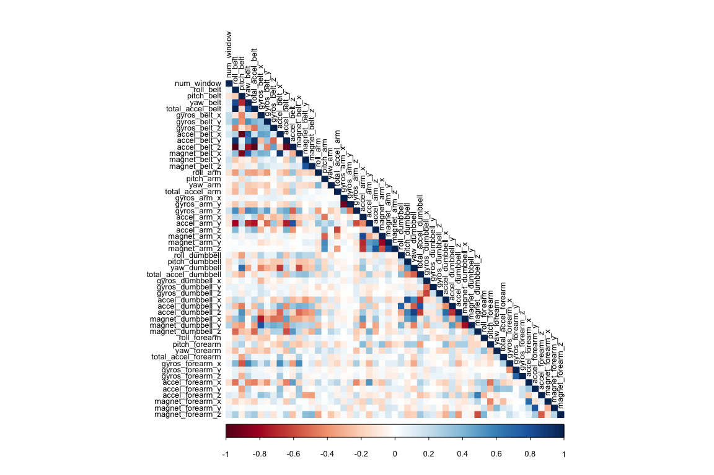
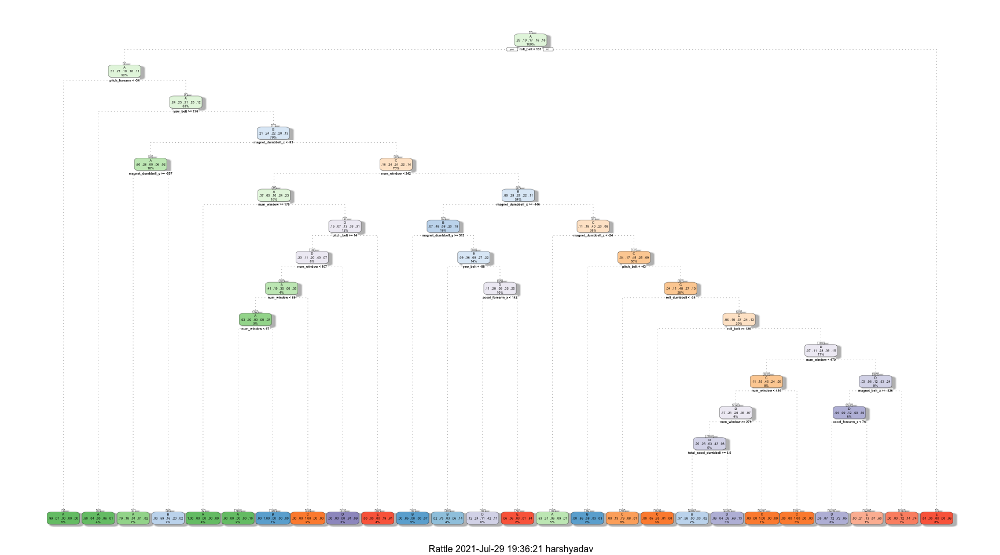

## Overview

Using devices such as Jawbone Up, Nike FuelBand, and Fitbit, it is now possible to collect a large amount of data about personal activity relatively inexpensively. The aim of this project is to predict the manner in which participants perform a barbell lift. The data comes from http://groupware.les.inf.puc-rio.br/har wherein 6 participants were asked to perform the same set of exercises correctly and incorrectly with accelerometers placed on the belt, forearm, arm, and dumbell.  

For the purpose of this project, the following steps would be followed:

1. Data Preprocessing
2. Exploratory Analysis
3. Prediction Model Selection
4. Predicting Test Set Output

## Data Preprocessing 

First, we load the training and testing set from the online sources and then split the training set further into training and test sets. 


```r
library(caret)
trainURL <- "http://d396qusza40orc.cloudfront.net/predmachlearn/pml-training.csv"
testURL <- "http://d396qusza40orc.cloudfront.net/predmachlearn/pml-testing.csv"

training <- read.csv(url(trainURL))
testing <- read.csv(url(testURL))

label <- createDataPartition(training$classe, p = 0.7, list = FALSE)
train <- training[label, ]
test <- training[-label, ]
```

From among 160 variables present in the dataset, some variables have nearly zero variance whereas some contain a lot of NA terms which need to be excluded from the dataset. Moreover, other 5 variables used for identification can also be removed. 


```r
NZV <- nearZeroVar(train)
train <- train[ ,-NZV]
test <- test[ ,-NZV]

label <- apply(train, 2, function(x) mean(is.na(x))) > 0.95
train <- train[, -which(label, label == FALSE)]
test <- test[, -which(label, label == FALSE)]

train <- train[ , -(1:5)]
test <- test[ , -(1:5)]
```

As a result of the preprocessing steps, we were able to reduce 160 variables to 54.

## Exploratory Analysis

Now that we have cleaned the dataset off absolutely useless varibles, we shall look at the dependence of these variables on each other through a correlation plot. 


```r
library(corrplot)
```

```
## corrplot 0.90 loaded
```

```r
corrMat <- cor(train[,-54])
corrplot(corrMat, method = "color", type = "lower", tl.cex = 0.8, tl.col = rgb(0,0,0))
```

<!-- -->

In the plot above, darker gradient correspond to having high correlation. A Principal Component Analysis can be run to further reduce the correlated variables but we aren't doing that due to the number of correlations being quite few.

## Prediction Model Selection

We will use 3 methods to model the training set and thereby choose the one having the best accuracy to predict the outcome variable in the testing set. The methods are Decision Tree, Random Forest and Generalized Boosted Model.

A confusion matrix plotted at the end of each model will help visualize the analysis better.

### Decision Tree


```r
library(rpart)
library(rpart.plot)
library(rattle)
set.seed(13908)
modelDT <- rpart(classe ~ ., data = train, method = "class")
fancyRpartPlot(modelDT)
```

<!-- -->

```r
predictDT <- predict(modelDT, test, type = "class")
confMatDT <- confusionMatrix(predictDT, as.factor(test$classe))
confMatDT
```

```
## Confusion Matrix and Statistics
## 
##           Reference
## Prediction    A    B    C    D    E
##          A 1508  184   16   38   34
##          B   57  694   53   66   56
##          C    1   58  830   34    3
##          D   98  176  104  750  116
##          E   10   27   23   76  873
## 
## Overall Statistics
##                                           
##                Accuracy : 0.791           
##                  95% CI : (0.7804, 0.8013)
##     No Information Rate : 0.2845          
##     P-Value [Acc > NIR] : < 2.2e-16       
##                                           
##                   Kappa : 0.7354          
##                                           
##  Mcnemar's Test P-Value : < 2.2e-16       
## 
## Statistics by Class:
## 
##                      Class: A Class: B Class: C Class: D Class: E
## Sensitivity            0.9008   0.6093   0.8090   0.7780   0.8068
## Specificity            0.9354   0.9511   0.9802   0.8996   0.9717
## Pos Pred Value         0.8472   0.7495   0.8963   0.6029   0.8652
## Neg Pred Value         0.9596   0.9103   0.9605   0.9539   0.9571
## Prevalence             0.2845   0.1935   0.1743   0.1638   0.1839
## Detection Rate         0.2562   0.1179   0.1410   0.1274   0.1483
## Detection Prevalence   0.3025   0.1573   0.1573   0.2114   0.1715
## Balanced Accuracy      0.9181   0.7802   0.8946   0.8388   0.8893
```

### Random Forest


```r
library(caret)
set.seed(13908)
control <- trainControl(method = "cv", number = 3, verboseIter=FALSE)
modelRF <- train(classe ~ ., data = train, method = "rf", trControl = control)
modelRF$finalModel
```

```
## 
## Call:
##  randomForest(x = x, y = y, mtry = min(param$mtry, ncol(x))) 
##                Type of random forest: classification
##                      Number of trees: 500
## No. of variables tried at each split: 27
## 
##         OOB estimate of  error rate: 0.25%
## Confusion matrix:
##      A    B    C    D    E class.error
## A 3906    0    0    0    0 0.000000000
## B    8 2642    6    2    0 0.006019564
## C    0    4 2392    0    0 0.001669449
## D    0    0    8 2243    1 0.003996448
## E    0    0    0    5 2520 0.001980198
```

```r
predictRF <- predict(modelRF, test)
confMatRF <- confusionMatrix(predictRF, as.factor(test$classe))
confMatRF
```

```
## Confusion Matrix and Statistics
## 
##           Reference
## Prediction    A    B    C    D    E
##          A 1673    6    0    0    0
##          B    0 1133    1    0    2
##          C    0    0 1025    7    0
##          D    0    0    0  957    2
##          E    1    0    0    0 1078
## 
## Overall Statistics
##                                          
##                Accuracy : 0.9968         
##                  95% CI : (0.995, 0.9981)
##     No Information Rate : 0.2845         
##     P-Value [Acc > NIR] : < 2.2e-16      
##                                          
##                   Kappa : 0.9959         
##                                          
##  Mcnemar's Test P-Value : NA             
## 
## Statistics by Class:
## 
##                      Class: A Class: B Class: C Class: D Class: E
## Sensitivity            0.9994   0.9947   0.9990   0.9927   0.9963
## Specificity            0.9986   0.9994   0.9986   0.9996   0.9998
## Pos Pred Value         0.9964   0.9974   0.9932   0.9979   0.9991
## Neg Pred Value         0.9998   0.9987   0.9998   0.9986   0.9992
## Prevalence             0.2845   0.1935   0.1743   0.1638   0.1839
## Detection Rate         0.2843   0.1925   0.1742   0.1626   0.1832
## Detection Prevalence   0.2853   0.1930   0.1754   0.1630   0.1833
## Balanced Accuracy      0.9990   0.9971   0.9988   0.9962   0.9980
```

### Generalized Boosted Model


```r
library(caret)
set.seed(13908)
control <- trainControl(method = "repeatedcv", number = 5, repeats = 1, verboseIter = FALSE)
modelGBM <- train(classe ~ ., data = train, trControl = control, method = "gbm", verbose = FALSE)
modelGBM$finalModel
```

```
## A gradient boosted model with multinomial loss function.
## 150 iterations were performed.
## There were 53 predictors of which 53 had non-zero influence.
```

```r
predictGBM <- predict(modelGBM, test)
confMatGBM <- confusionMatrix(predictGBM, as.factor(test$classe))
confMatGBM
```

```
## Confusion Matrix and Statistics
## 
##           Reference
## Prediction    A    B    C    D    E
##          A 1667   13    0    0    0
##          B    7 1108   10    7    5
##          C    0   15 1014   12    4
##          D    0    3    2  944   12
##          E    0    0    0    1 1061
## 
## Overall Statistics
##                                          
##                Accuracy : 0.9845         
##                  95% CI : (0.981, 0.9875)
##     No Information Rate : 0.2845         
##     P-Value [Acc > NIR] : < 2.2e-16      
##                                          
##                   Kappa : 0.9804         
##                                          
##  Mcnemar's Test P-Value : NA             
## 
## Statistics by Class:
## 
##                      Class: A Class: B Class: C Class: D Class: E
## Sensitivity            0.9958   0.9728   0.9883   0.9793   0.9806
## Specificity            0.9969   0.9939   0.9936   0.9965   0.9998
## Pos Pred Value         0.9923   0.9745   0.9703   0.9823   0.9991
## Neg Pred Value         0.9983   0.9935   0.9975   0.9959   0.9956
## Prevalence             0.2845   0.1935   0.1743   0.1638   0.1839
## Detection Rate         0.2833   0.1883   0.1723   0.1604   0.1803
## Detection Prevalence   0.2855   0.1932   0.1776   0.1633   0.1805
## Balanced Accuracy      0.9964   0.9833   0.9910   0.9879   0.9902
```

As Random Forest offers the maximum accuracy of 99.75%, we will go with Random Forest Model to predict our test data class variable.

## Predicting Test Set Output


```r
predictRF <- predict(modelRF, testing)
predictRF
```

```
##  [1] B A B A A E D B A A B C B A E E A B B B
## Levels: A B C D E
```
